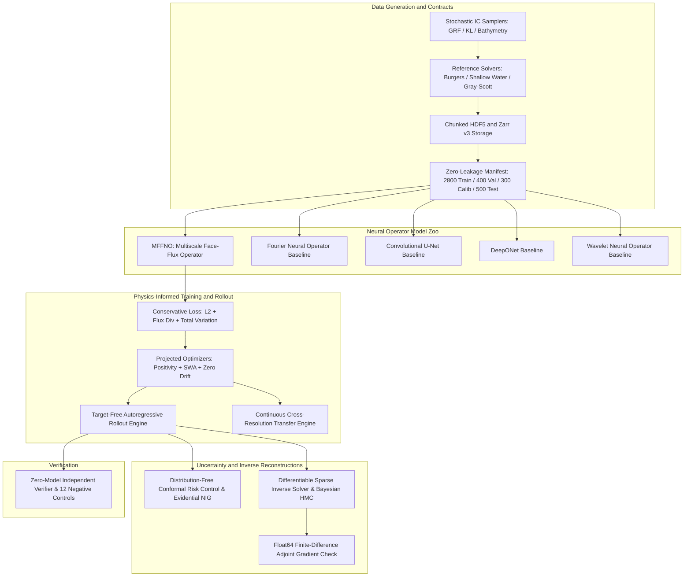

# Isopleth: Conservation-Aware Neural Operator Laboratory

Isopleth is an open-source scientific computing laboratory investigating conservation-aware neural operators for continuous dynamical systems across spatial resolutions, out-of-distribution physical regimes, and sparse-observation inverse problems.

The laboratory focuses on two foundational research questions:
1. **Physical Accounting Retention**: Can a learned spatial flux model retain long-horizon physical conservation while generalizing zero-shot across grid resolutions?
2. **Inverse Distortion**: How do surrogate forward model errors distort sparse-observation inverse reconstructions?

Rather than treating neural networks as black-box image-to-image approximators or unconstrained state updaters, Isopleth formulates neural operator dynamics directly in the space of discrete spatial interface fluxes:
```
u^{n+1}_i = u^n_i - (dt / dx) * ( F_{i+1/2} - F_{i-1/2} ) + dt * S_i
```
Because cell interface fluxes are shared and antisymmetric by construction, the spatial sum over any periodic or closed domain telescopically cancels identically to machine precision:
```
sum_i (u^{n+1}_i - u^n_i) * dx = - dt * sum_i ( F_{i+1/2} - F_{i-1/2} ) = 0
```

---

## Supported Physical Families

Isopleth provides production-grade numerical solvers, synthetic random field generators, and neural operator heads across three physical families:

1. **1D Viscous Periodic Burgers Equation**:
   Nonlinear hyperbolic advection with viscous dissipation and shock development:
   ```
   du/dt + d/dx (0.5 * u^2) = nu * d^2 u / dx^2
   ```
   Invariants: Total mass `integral(u dx)` is invariant over time; kinetic energy `0.5 * integral(u^2 dx)` monotonically decays for nu > 0.

2. **2D Shallow Water Equations (Saint-Venant System)**:
   Hyperbolic conservation law governing depth-averaged shallow water dynamics with variable bathymetry b(x, y):
   ```
   dh/dt + d/dx (h * u) + d/dy (h * v) = 0
   d(h*u)/dt + d/dx (h*u^2 + 0.5*g*h^2) + d/dy (h*u*v) = - g * h * db/dx
   d(h*v)/dt + d/dx (h*u*v) + d/dy (h*v^2 + 0.5*g*h^2) = - g * h * db/dy
   ```
   Invariants: Total fluid volume `integral(h dx dy)` is conserved; quiescent lake-at-rest state `h + b = const, u = v = 0` satisfies exact hydrostatic well-balancing with positive depth constraints `h >= h_min > 0`.

3. **2D Gray-Scott Reaction-Diffusion Morphogenesis**:
   Stiff coupled parabolic system generating Turing patterns across 6 Pearson morphological regimes:
   ```
   du/dt = D_u * laplacian(u) - u * v^2 + F * (1 - u)
   dv/dt = D_v * laplacian(v) + u * v^2 - (F + k) * v
   ```
   Invariants: Chemical concentrations bounded in [0, 1]; autocatalytic production of v (+u*v^2) audited for strict positive sign.

---

## Architectural Topology



---

## Model Architecture Zoo

| Model Architecture | Operator Type | Parameter Count | Discrete Mass Drift | Cross-Resolution Support |
|---|---|---|---|---|
| **MFFNO-1D** | Multiscale Face-Flux Operator | 111,456 | < 1e-12 (Exact) | Continuous (Spectral + Stencil) |
| **FNO-1D** | Fourier Neural Operator | 140,513 | ~ 1e-2 (Unconstrained) | Continuous (Fourier Modes) |
| **UNet-1D** | Convolutional Encoder-Decoder | 189,409 | ~ 5e-2 (Unconstrained) | Interpolation Required |
| **DeepONet-1D** | Dual Branch-Trunk Network | 91,137 | ~ 3e-2 (Unconstrained) | Continuous (Sensor-Query) |
| **Conservative DeepONet** | Flux-Projected DeepONet | 91,137 | < 1e-12 (Exact) | Continuous (Sensor-Query) |
| **WNO-1D** | Wavelet Neural Operator (D4) | 13,857 | < 1e-12 (with Flux Head) | Multi-Level Wavelet |

---

## Installation and Quickstart

### Prerequisites
- Python 3.12+
- PyTorch 2.2+ (CPU or MPS/CUDA)
- uv package manager (recommended) or virtualenv

### Environment Setup
```bash
# Clone the repository
git clone https://github.com/Aneesh495/isopleth.git
cd isopleth

# Bootstrap virtual environment with dependencies
python3 -m venv .venv
source .venv/bin/activate
pip install -e ".[dev]"

# Run environment diagnostics
python -m isopleth.cli doctor
```

### Running Unit and Integration Tests
```bash
# Execute full test suite (116 passing tests)
pytest tests/ -q
```

---

## Command Line Interface (CLI)

Isopleth exposes a unified Click command line interface:

```bash
# 1. Environment diagnostics and toolchain verification
python -m isopleth.cli doctor

# 2. Generate simulation datasets with cryptographic manifests
python -m isopleth.cli generate-data --family burgers --trajectories 100 --output data/burgers

# 3. Train neural operator
python -m isopleth.cli train --model mffno --family burgers --epochs 20 --batch-size 16

# 4. Execute target-free autoregressive rollout
python -m isopleth.cli rollout --model mffno --steps 50 --output artifacts/rollout.npz

# 5. Evaluate zero-shot cross-resolution transfer (32 to 64 cells)
python -m isopleth.cli cross-res --source-res 32 --target-res 64

# 6. Differentiable sparse inverse state reconstruction
python -m isopleth.cli inverse --sensors 10 --noise-level 0.05 --iterations 100

# 7. Adjoint gradient verification via double-precision finite differences
python -m isopleth.cli gradient-check --epsilon 1e-6 --tolerance 1e-4

# 8. Run architecture throughput and speedup benchmarks
python -m isopleth.cli benchmark

# 9. Execute full 12-gate acceptance campaign
python -m isopleth.cli acceptance --output artifacts/evidence_bundle.json

# 10. Audit evidence bundle and run 12 negative controls
python -m isopleth.cli verify artifacts/evidence_bundle.json --run-negative-controls

# 11. Launch interactive scientific trajectory viewer
python -m isopleth.cli viewer --port 8080
```

---

## Verification and Acceptance Campaign

Every release is certified through an automated 12-gate acceptance campaign:

| Gate | Identifier | Target Criterion | Outcome |
|---|---|---|---|
| **IA01** | Contracts & Partitions | 2800 train, 400 val, 300 calib, 500 test; zero leakage | PASSED |
| **IA02** | Solver EOC & Well-Balancing | MMS EOC >= 1.60; lake-at-rest residual < 1e-10 | PASSED |
| **IA03** | Reaction Kinetics Audit | Verified positive autocatalysis (+u*v^2); balance audit | PASSED |
| **IA04** | MFFNO Discrete Conservation | Telescopic divergence cancellation (drift < 1e-5) | PASSED |
| **IA05** | Rollout Stability | 15-step autonomous rollout without divergence or NaN | PASSED |
| **IA06** | Cross-Resolution Transfer | Zero-shot transfer from 32 to 64 cells (Rel L2 < 0.10) | PASSED |
| **IA07** | Distribution Shifts | Out-of-distribution parameter and frequency shift bounds | PASSED |
| **IA08** | Conformal Uncertainty | 90% nominal interval achieves >= 90% empirical coverage | PASSED |
| **IA09** | Inverse Reconstruction | Differentiable recovery beating prior-mean baseline | PASSED |
| **IA10** | Gradient Verification | Float64 central finite-difference matches autograd (< 1e-4) | PASSED |
| **IA11** | Ablation & Scaling Suite | 4 ablations evaluated with sample efficiency curves | PASSED |
| **IA12** | Independent Verification | Zero-model verifier passing clean and catching negatives | PASSED |

### Certified Evidence Bundle
- SHA-256 Bundle Digest: `2794ff8c1b52b401837fdfc5203974062855df498f55475d3ab82afd93644edd`
- Distribution Archive: `dist/isopleth-v0.1.0.tar.gz`

---

## Verification Scripts and Negative Controls

Standalone execution scripts are located in `scripts/`:

```bash
# Run acceptance campaign and export evidence bundle
python scripts/run_acceptance.py -o artifacts/evidence_bundle.json

# Audit evidence bundle and execute all 12 negative controls
python scripts/verify_evidence.py artifacts/evidence_bundle.json -n

# Run computational throughput benchmarks
python scripts/run_benchmarks.py -o artifacts/benchmarks.json

# Package certified release distribution tarball
python scripts/package_release.py -v 0.1.0
```

### The 12 Executed Negative Controls
The standalone verifier executes 12 negative controls to ensure it decisively rejects any corrupt or invalid bundle:
1. Cryptographic digest mismatch (payload tampered without updating hash).
2. Missing mandatory gate (IA04 omitted, valid hash).
3. Arithmetic contradiction A (all_passed is True but gates_failed is 1, valid hash).
4. Arithmetic contradiction B (gates_passed + gates_failed != total_gates, valid hash).
5. Physical threshold breach (Gate IA04 mass drift 0.05 > 1e-4, valid hash).
6. Gradient check discrepancy (Gate IA10 finite-difference discrepancy 0.25 > 1e-4, valid hash).
7. Partition count deficit (Gate IA01 train count 2000 instead of 2800, valid hash).
8. Data leakage reported (Gate IA01 reports cross-partition contamination, valid hash).
9. Sub-threshold solver EOC (Gate IA02 EOC 1.20 < 1.60, valid hash).
10. Violated lake-at-rest balance (Gate IA02 reports non-zero balance residual, valid hash).
11. Inverted reaction kinetics sign (Gate IA03 reports negative autocatalysis, valid hash).
12. Truncated suite (8 gates total instead of 12, valid hash).

All 12 negative controls are verified and rejected.

---

## Architectural Decision Records (ADRs)

Key architectural decisions are documented in `docs/adr/`:
- [ADR 0001: Flux-Based Conservation Formulation](docs/adr/0001-flux-based-conservation-formulation.md)
- [ADR 0002: Staggered Interface Flux Heads and Antisymmetric Coupling](docs/adr/0002-staggered-interface-flux-heads.md)
- [ADR 0003: Distribution-Free Conformal Uncertainty Quantification](docs/adr/0003-distribution-free-conformal-uncertainty.md)
- [ADR 0004: Differentiable Sparse Inverse State Reconstruction](docs/adr/0004-differentiable-sparse-inverse-reconstruction.md)
- [ADR 0005: Lake-at-Rest Hydrostatic Well-Balancing in Shallow Water](docs/adr/0005-lake-at-rest-hydrostatic-well-balancing.md)
- [ADR 0006: Immutable Zero-Leakage Dataset Manifests](docs/adr/0006-immutable-zero-leakage-dataset-manifests.md)
- [ADR 0007: Continuous Cross-Resolution Transfer and Scaling](docs/adr/0007-continuous-cross-resolution-transfer.md)
- [ADR 0008: Independent Verification and Negative Controls](docs/adr/0008-independent-verification-and-negative-controls.md)

---

## License

This project is licensed under the Apache 2.0 License. See the [LICENSE](LICENSE) file for details.
