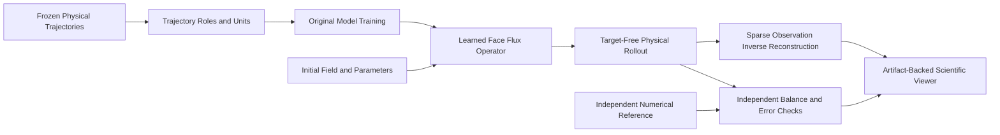

# Isopleth: Conservation-Aware Neural Operators

Isopleth is an open-source scientific computing laboratory investigating conservation-aware neural operators for learning dynamical systems across spatial resolutions and physical regimes.

The project examines two fundamental questions in operator learning:
1. Can a learned spatial flux model retain long-horizon physical accounting while generalizing beyond its training grid and parameter range?
2. How do errors in a learned forward model distort inverse reconstruction from sparse noisy measurements?

Rather than treating deep networks as black-box image-to-image approximators or unconstrained autoregressive predictors, Isopleth formulates neural operator updates via discrete spatial fluxes over cell interfaces. Discrete divergence of face fluxes guarantees local and global conservation properties by construction, while preserving resolution invariance and admitting explicit source and boundary handling.

## Supported Physical Families

- **1D Viscous Burgers Equation**: Periodic nonlinear advection-diffusion dynamics with shock formation and viscous dissipation.
- **2D Shallow-Water Equations**: Saint-Venant hyperbolic system governing shallow fluid layer dynamics, gravity waves, vortex structures, and lake-at-rest equilibria with positive depth constraints.
- **Gray-Scott Reaction-Diffusion**: Public benchmark adapter evaluating multi-species reaction kinetics across standard physical regimes.

## Core Capabilities

- **Finite Volume Reference Solvers**: High-order numerical solvers featuring Godunov, Rusanov, and Kurganov-Tadmor schemes, TVD slope limiters (minmod, van Leer, superbee), and explicit Runge-Kutta time integration.
- **Multiscale Face-Flux Neural Operator (MFFNO)**: Primary neural operator architecture combining multiscale spectral representations and local receptive fields with an antisymmetric interface flux head.
- **Operator Baselines**: Original Fourier Neural Operator (FNO) and convolutional U-Net implementations for rigorous comparative benchmarking.
- **Continuous Resolution Generalization**: Zero-shot transfer from coarse training grids to fine evaluation discretizations using continuous physical coordinates and face metrics.
- **Differentiable Inverse Reconstruction**: Adjoint and automatic differentiation pipelines reconstructing initial fields and physical parameters from sparse, noisy point observations.
- **Uncertainty Quantification**: Trajectory-level ensemble calibration and conformal uncertainty intervals.
- **Interactive Scientific Viewer**: Self-contained inspection workbench for spatiotemporal trajectories, spectral cascades, physical balance residuals, and inverse optimization histories.

## Installation and Quick Start

### Prerequisites
- Python 3.12+
- PyTorch 2.2+ (CPU or MPS/CUDA)
- uv (recommended) or standard virtualenv

### Setup
```bash
# Clone the repository
git clone https://github.com/Aneesh495/isopleth.git
cd isopleth

# Bootstrap environment and install dependencies
make bootstrap

# Run diagnostics
make doctor

# Execute deterministic test suite
make test
```

## Running Experiments

```bash
# Generate and validate trajectory datasets
make data

# Train primary face-flux operator and baselines
make train

# Evaluate long-horizon rollouts and cross-resolution transfer
make evaluate

# Execute sparse inverse reconstruction
make inverse

# Launch interactive scientific viewer
make demo
```

## Architecture Overview



## Verification and Reproducibility

Every numerical experiment, trained checkpoint, and evaluation metric is bound to frozen dataset manifests and reproducible random seeds. Independent verification scripts confirm conservation invariants, finite-difference gradient checks, and generalization bounds.
