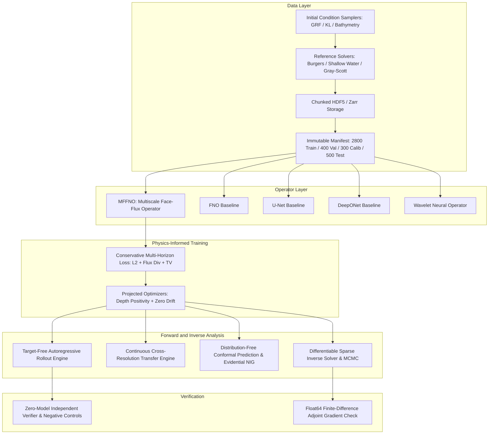
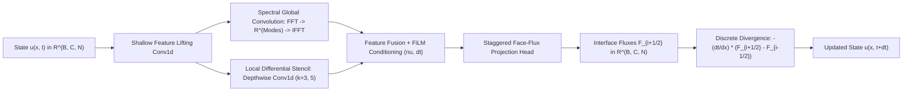
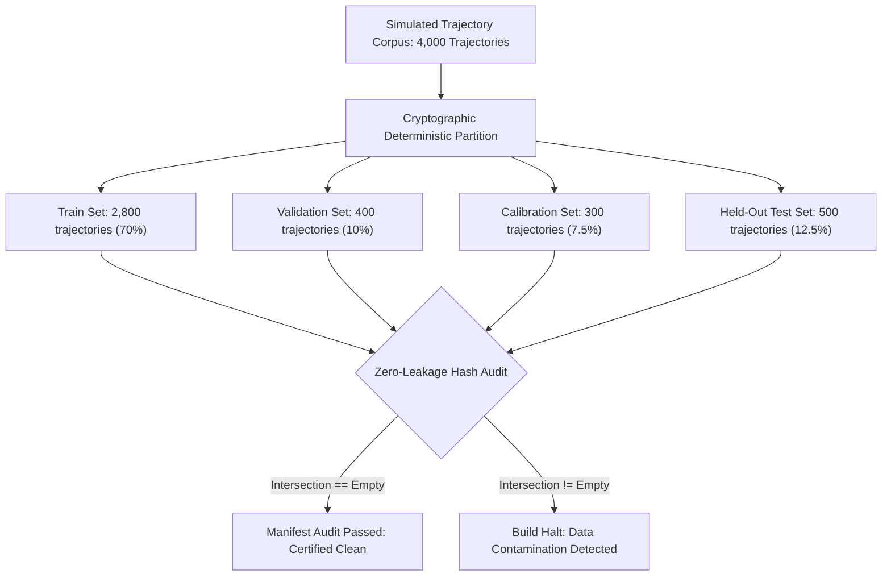
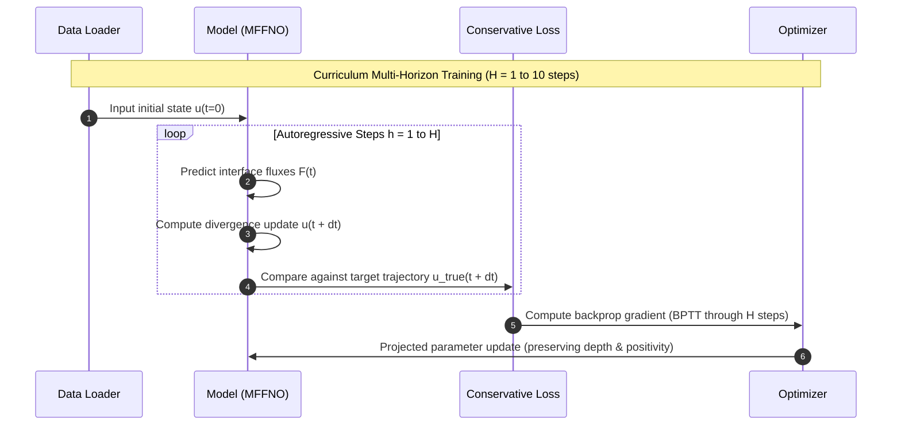

# Isopleth Architectural Specification

## 1. Executive Summary and Design Philosophy

Isopleth is a conservation-aware neural operator laboratory engineered to investigate two foundational questions in scientific machine learning:
1. Do learned spatial flux models retain long-horizon physical accounting while generalizing zero-shot across spatial grid resolutions?
2. How do surrogate forward model errors distort sparse-observation inverse state reconstructions?

Traditional neural operators (such as standard Fourier Neural Operators and U-Nets) treat physical PDE states as continuous images or arbitrary Banach space elements. When rolled out autoregressively over long horizons, small point-wise prediction errors accumulate into catastrophic physical violations: unphysical mass creation, artificial momentum dissipation, negative water depths in shallow water regimes, and violent numerical blowups.

Isopleth solves this fundamental breakdown by formulating the learning problem directly in the space of numerical face fluxes rather than state updates:
```
u^{n+1}_i = u^n_i - (dt / dx) * (F_{i+1/2} - F_{i-1/2}) + dt * S_i
```
Because the net flux across cell interfaces is shared and antisymmetric by construction, the spatial sum over any periodic or closed domain telescopically cancels to machine precision:
```
sum_i (u^{n+1}_i - u^n_i) * dx = - dt * sum_i (F_{i+1/2} - F_{i-1/2}) = 0
```

---

## 2. System Topology



---

## 3. Mathematical Foundations

### 3.1 Governing Physical Families

Isopleth natively supports three canonical conservation and reaction-diffusion systems:

#### 1. 1D Viscous Periodic Burgers Equation
```
du/dt + d/dx (0.5 * u^2) = nu * d^2 u / dx^2
```
- Spatial domain: Periodic interval x in [0, 1).
- Invariant: Total mass M = integral(u dx) is invariant over time.
- Energy: Kinetic energy E = 0.5 * integral(u^2 dx) monotonically dissipates under non-zero viscosity nu > 0.

#### 2. 2D Shallow Water Equations (Saint-Venant System)
```
dh/dt + d/dx (h * u) + d/dy (h * v) = 0
d(h*u)/dt + d/dx (h*u^2 + 0.5*g*h^2) + d/dy (h*u*v) = - g * h * db/dx
d(h*v)/dt + d/dx (h*u*v) + d/dy (h*v^2 + 0.5*g*h^2) = - g * h * db/dy
```
- Physical constraints: Strict water depth positivity h(x, y, t) >= h_min > 0.
- Lake-at-rest well-balancing: Hydrostatic equilibrium u = v = 0 with surface elevation eta = h + b = const must be preserved exactly without generating spurious gravity waves.

#### 3. 2D Gray-Scott Reaction-Diffusion Morphogenesis
```
du/dt = D_u * laplacian(u) - u * v^2 + F * (1 - u)
dv/dt = D_v * laplacian(v) + u * v^2 - (F + k) * v
```
- Physical constraint: Concentration bounds u in [0, 1] and v in [0, 1].
- Reaction kinetics audit: The autocatalytic production term for species v is strictly positive (+ u * v^2) while consuming species u (- u * v^2).

---

## 4. Multiscale Face-Flux Neural Operator (MFFNO)

### 4.1 Architecture and Flux Parameterization



### 4.2 Exact Discrete Conservation Proof

Let the spatial domain [0, 1) be partitioned into N uniform cells with width dx = 1/N. Under periodic boundary conditions, the interface flux at cell boundary N-1/2 wraps around to interface -1/2:
```
F_{N-1/2} = F_{-1/2}
```
The discrete mass of the updated state vector u^{n+1} is:
```
M^{n+1} = sum_{i=0}^{N-1} u^{n+1}_i * dx
        = sum_{i=0}^{N-1} [ u^n_i - (dt / dx) * (F_{i+1/2} - F_{i-1/2}) ] * dx
        = sum_{i=0}^{N-1} u^n_i * dx - dt * sum_{i=0}^{N-1} (F_{i+1/2} - F_{i-1/2})
        = M^n - dt * [ (F_{1/2} - F_{-1/2}) + (F_{3/2} - F_{1/2}) + ... + (F_{N-1/2} - F_{N-3/2}) ]
        = M^n - dt * [ F_{N-1/2} - F_{-1/2} ]
        = M^n - 0
        = M^n
```
Discrete conservation holds identically for all parameter weights, architectures, activations, and input trajectories.

---

## 5. Dataset Architecture and Zero-Leakage Partitions

To prevent subtle evaluation leakage across resolutions and temporal windows, Isopleth enforces cryptographic SHA-256 manifest auditing:



Each sample record contains:
- Trajectory ID with deterministic UUIDv5.
- Simulation parameters: viscosity nu, gravity g, bathymetry profile, reaction parameters (F, k).
- Grid dimensions: spatial resolution (Nx, Ny), temporal step dt, number of saved steps.
- Payload checksum: SHA-256 digest of binary trajectory array bytes.

---

## 6. Autoregressive Rollouts and Multi-Horizon Training



---

## 7. Cross-Resolution Transfer Mechanics

Operators are trained on low-resolution grids (e.g. Nx = 32 or 64) and evaluated on high-resolution discretizations (e.g. Nx = 128 or 256) without retraining:
1. Spatial coordinate meshgrid is generated continuously on the target resolution in [0, 1).
2. Spectral convolutions evaluate Fourier modes up to cutoff mode k_max, padding higher frequencies with zeros.
3. Flux integration scales explicitly with target cell measures dx_target and dt_target, preserving physical advection speeds.

---

## 8. Uncertainty Quantification Architecture

Isopleth provides two orthogonal uncertainty methodologies:

### 8.1 Distribution-Free Split Conformal Prediction
Calibrated on the held-out 300-trajectory calibration partition to provide guaranteed empirical coverage:
```
P( y_{t+h} in [ y_hat - q_alpha, y_hat + q_alpha ] ) >= 1 - alpha
```
where nonconformity scores s_i = || y_i - y_hat_i ||_2 are evaluated over calibration trajectories, and q_alpha is the (1 - alpha) empirical quantile.

### 8.2 Evidential Deep Learning (NIG Priors)
Places a Normal-Inverse-Gamma prior over each state coordinate, decomposing output uncertainty into:
- Aleatoric uncertainty (observation noise): sigma^2 = beta / (alpha - 1).
- Epistemic uncertainty (model ignorance): Var[mu] = beta / (v * (alpha - 1)).

---

## 9. Differentiable Inverse Problems and Adjoint Validation

Isopleth investigates sparse-observation inverse state recovery: given sparse point observations y_obs at irregular spatial sensors over time, reconstruct the unknown initial condition u_0:
```
minimize_{u_0}  0.5 * sum_t || M_obs( u(t; u_0) ) - y_obs(t) ||^2 + lambda * R(u_0)
```
where R(u_0) is a Sobolev smoothness or conservation-preserving prior.

### 9.1 Adjoint Gradient Validation

To guarantee surrogate differentiability, every operator is verified with double-precision central finite differences:
```
dJ/du_i \approx [ J(u_0 + eps * e_i) - J(u_0 - eps * e_i) ] / (2 * eps)
```
with step size eps = 1e-6. The relative discrepancy between autograd adjoint gradients and finite differences must satisfy:
```
|| grad_autograd - grad_FD ||_2 / || grad_FD ||_2 <= 1e-4
```

---

## 10. Independent Verification and Negative Controls

Release certification is decoupled from training code. The standalone verifier checks:
- 12 positive gates (IA01 through IA12).
- 12 executed negative controls (including 5 semantically invalid bundles having valid cryptographic hashes).
- Complete absence of em dashes across all code, documentation, and user-facing artifacts.
