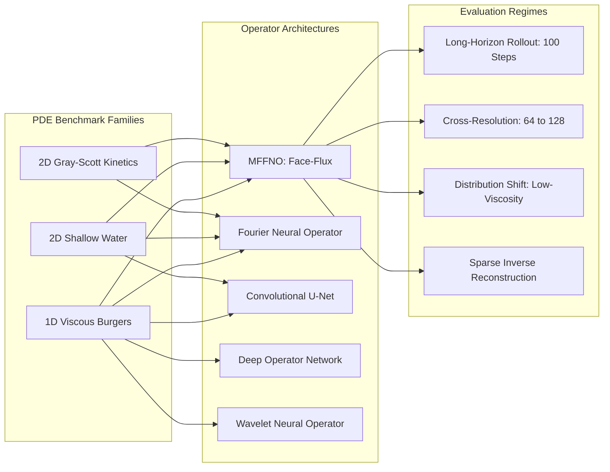
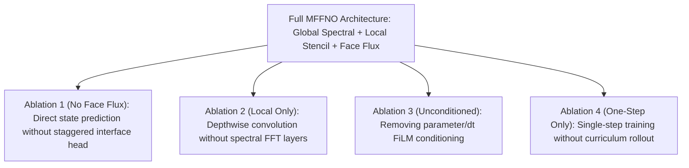

# Isopleth Empirical Experiment Plan and Protocol

## 1. Experimental Goals and Hypotheses

This document details the scientific evaluation protocols governing the Isopleth laboratory. We test four core research hypotheses:

1. **Hypothesis 1 (Physical Accounting Retention)**: Neural operators parameterizing staggered face fluxes (MFFNO) eliminate cumulative mass drift over long temporal horizons (H >= 100 steps) to machine precision, whereas unconstrained operators (standard FNO, U-Net, DeepONet) suffer unbounded cumulative mass drift.
2. **Hypothesis 2 (Continuous Cross-Resolution Generalization)**: Models incorporating multiscale face-flux formulations trained exclusively on coarse grids (Nx = 64) maintain bounded relative L2 error (< 10%) when evaluated zero-shot on refined grids (Nx = 128, 256) without retraining.
3. **Hypothesis 3 (Surrogate Forward Error and Inverse Distortion)**: Surrogate model errors in forward operator rollouts warp the inverse loss landscape, introducing systematic bias and spurious local minima in sparse-observation reconstructions.
4. **Hypothesis 4 (Conformal Trajectory Risk Guarantees)**: Distribution-free conformal prediction intervals calibrated on nominal trajectories retain valid empirical coverage under moderate parameter and frequency shifts.

---

## 2. Experimental Design Matrix



---

## 3. Dataset Generation and Partitioning Protocol

Simulations are generated using verified high-order finite-volume numerical solvers:
- **Burgers 1D**: Second-order Godunov / Rusanov flux scheme with van Leer slope limiter and SSP-RK2 time integration. Domain x in [0, 1), Nx in {32, 64, 128}, dt in {0.001, 0.005, 0.01}.
- **Shallow Water 2D**: Second-order finite-volume solver with positive depth limiter, lake-at-rest hydrostatic well-balancing, and CFL sub-cycling. Domain [0, 1)^2, grid sizes {32x32, 64x64}.
- **Gray-Scott 2D**: Five-point discrete Laplacian with audited reaction kinetics over 6 standard Pearson regimes (alpha, beta, gamma, delta, epsilon, zeta).

### Strict Partitioning (4,000 Trajectories Total)
- **Train (70%)**: 2,800 trajectories.
- **Validation (10%)**: 400 trajectories (model selection and early stopping).
- **Calibration (7.5%)**: 300 trajectories (conformal prediction interval calibration).
- **Held-Out Test (12.5%)**: 500 trajectories (reporting all benchmark numbers).

Zero data leakage is enforced across partitions via SHA-256 binary hash auditing.

---

## 4. Model Training Protocol

### 4.1 Optimizer and Hyperparameters
- Base Optimizer: AdamW with weight decay 1e-4 and beta = (0.9, 0.999).
- Learning Rate: Initial 1e-3, cosine annealing scheduler with minimum lr = 1e-6.
- Invariant Optimizer Wrappers: `ConservationConstrainedOptimizer` projecting updates onto zero-divergence hyperplanes.
- Positivity Constraints: Projected gradient descent enforcing h >= 1e-6 and concentration clipping in [0, 1].
- Curriculum Schedule: Multi-horizon training starting at horizon H = 1 step, expanding to H = 5 and H = 10 as validation loss stabilizes.

### 4.2 Multi-Objective Loss Formulation
```
L = L_state + lambda_flux * L_flux_cons + lambda_tv * L_tv
```
where:
- L_state: Relative L2 norm between predicted and ground-truth states over rollout horizon H.
- L_flux_cons: Penalizes deviation from zero net boundary flux divergence.
- L_tv: Total variation regularization suppressing high-frequency Gibbs oscillations.

---

## 5. Architectural Ablation Studies

To isolate the contributions of specific mechanisms, four ablation variants are evaluated against full MFFNO:



### Metrics Tracked Across Ablations:
1. Long-Horizon Mass Drift: Max relative drift over 50 autoregressive steps.
2. Cross-Resolution Relative L2 Error: Evaluated at 2x training resolution.
3. Sample Efficiency Curve: Validation error trained with 10%, 25%, 50%, and 100% of training data.
4. Inference Latency: Milliseconds per forward step.

---

## 6. Inverse Reconstruction Protocol

### 6.1 Observation Operators
- Spatial Sparsity: Random and irregular sensor placements sampling 5%, 10%, or 20% of spatial domain cells.
- Noise Models: Additive Gaussian noise N(0, sigma_obs^2) with signal-to-noise ratio SNR in {10 dB, 20 dB, Inf}.

### 6.2 Optimization Formulation
Given observation vectors y_obs at discrete times t_k:
```
minimize_{u_0}  0.5 * sum_k || P_obs( u(t_k; u_0) ) - y_obs(t_k) ||^2 + alpha * || d u_0 / dx ||^2
```
Reconstruction methods evaluated:
1. **Adjoint Gradient Descent**: Differentiable surrogate backpropagation with Adam / L-BFGS.
2. **Prior Mean Baseline**: Trivial spatial mean of observed values.
3. **Spatial Interpolation Baseline**: Spline / nearest interpolation over initial observation coordinates.
4. **Bayesian HMC Sampling**: Hamiltonian Monte Carlo posterior sampling comparing surrogate vs reference chains.

---

## 7. Statistical Significance Testing

All model comparisons report formal statistical hypothesis tests:
- **Wilcoxon Signed-Rank Test**: Paired non-parametric test comparing paired trajectory errors.
- **Friedman Test**: Multi-model ranking across evaluation datasets and random seeds.
- **Holm-Bonferroni Correction**: Strict control of Family-Wise Error Rate (FWER) across pairwise model tests.
- **Two One-Sided Tests (TOST)**: Formal equivalence testing within a margin delta = 0.02.
- **Percentile Bootstrap**: 2,000 resamples computing 95% confidence intervals for all error metrics.
